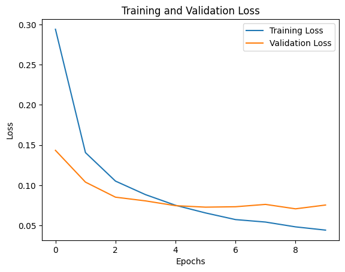

# Learning Curves in Machine Learning

Learning curves show how a model’s performance evolves over time (e.g., with more epochs or more training data).
They are powerful tools to **diagnose underfitting, overfitting, and generalization** in machine learning models.

---

## Types of Learning Curves

| Curve Type           | X-Axis                     | Y-Axis                      | Use                                |
| :------------------- | :------------------------- | :-------------------------- | :--------------------------------- |
| **Epoch-based**      | Epoch number               | Training & Validation loss  | Track performance over epochs      |
| **Data-size-based**  | Number of training samples | Accuracy / Error            | Understand impact of dataset size  |
| **Validation curve** | Hyperparameter value       | Training & Validation score | Examine effect of a hyperparameter |

---

## 1. Epoch-Based Learning Curves

These curves plot **training** and **validation** loss versus **epochs**.

* **Training loss**: Error on training data after each epoch.
* **Validation loss**: Error on unseen validation data.

### Example Plot



### Interpretation

* **Overfitting** → Training loss decreases, validation loss increases after a point.
* **Underfitting** → Both losses are high and decrease slowly.
* **Good Fit** → Both losses decrease and plateau near each other.

---

## 2. Data-Size Learning Curves

These show model performance (accuracy or error) against the amount of training data.

* **X-axis:** Training dataset size
* **Y-axis:** Performance score (accuracy or error)

### Example Plot


### Interpretation

* **High bias (underfitting):** Both training and validation scores are low and converge together.
* **High variance (overfitting):** Large gap between training and validation scores.
* **Good generalization:** Curves converge at high accuracy.

---

## 3. Common Patterns in Learning Curves

### Underfitting (High Bias)

* Both training and validation losses are high.
* Curves flatten early.
* Model is too simple.


---

### Overfitting (High Variance)

* Training loss becomes very low.
* Validation loss starts increasing after some epochs.
* Model memorizes training data but fails to generalize.


---

### Good Fit (Balanced Model)

* Training and validation losses decrease and stabilize at similar values.
* Small gap indicates good generalization.


---

## 4. Reading the Curves

| Pattern          | Training Loss | Validation Loss         | Model Behavior    | Fix                                     |
| :--------------- | :------------ | :---------------------- | :---------------- | :-------------------------------------- |
| **Underfitting** | High          | High                    | Model too simple  | Increase model complexity               |
| **Overfitting**  | Low           | Increasing              | Model too complex | Add regularization, early stopping      |
| **Good Fit**     | Low           | Low (close to training) | Balanced          | Keep configuration                      |
| **Noisy Curve**  | Fluctuating   | Fluctuating             | Unstable training | Use smoother learning rate or more data |

---

## 5. Python Example: Plotting a Learning Curve

```python
from sklearn.model_selection import learning_curve
from sklearn.ensemble import RandomForestClassifier
from sklearn.datasets import load_digits
import matplotlib.pyplot as plt
import numpy as np

X, y = load_digits(return_X_y=True)
train_sizes, train_scores, test_scores = learning_curve(
    RandomForestClassifier(),
    X, y, cv=5, n_jobs=-1,
    train_sizes=np.linspace(0.1, 1.0, 10)
)

train_mean = np.mean(train_scores, axis=1)
test_mean = np.mean(test_scores, axis=1)

plt.plot(train_sizes, train_mean, label="Training score", color="blue")
plt.plot(train_sizes, test_mean, label="Validation score", color="orange")
plt.xlabel("Training Set Size")
plt.ylabel("Accuracy")
plt.title("Learning Curve")
plt.legend()
plt.show()
```

---

## 6. Diagnostic Insights

* **If both curves converge at low performance →** model underfits (increase capacity).
* **If curves diverge →** model overfits (add regularization, more data, or reduce complexity).
* **If both converge at high accuracy →** good generalization achieved.

---

## Summary

| Curve Type       | Insight                  | Fix                            |
| :--------------- | :----------------------- | :----------------------------- |
| **Underfitting** | High losses for both     | Add complexity, more features  |
| **Overfitting**  | Large gap between losses | Add dropout, regularization    |
| **Good Fit**     | Close low losses         | Model performs well            |
| **Noisy Curve**  | Unstable losses          | Tune learning rate, batch size |

---
